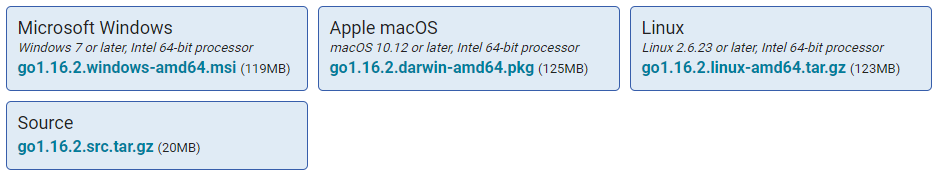

### Golang 基础

#### Go 环境安装

1. 安装包，Golang官网下载地址： [https://golang.org/dl/](https://golang.org/dl/)
2. 如果打不开上面的地址，那使用这个地址：[https://golang.google.cn/](https://golang.google.cn/)

3. 将 bin 目录添加到 path 环境变量中（Windows例如：C:\Go\bin）

#### Go 语言结构

> 1. package main 定义了包名，表示一个可独立执行的程序，每个 Go 应用程序都包含一个名为 main 的包
> 2. main 函数是每一个可执行程序所必须包含的，一般来说都是在启动后第一个执行的函数（如果有 init() 函数则会先执行该函数）
> 3. 同一个文件夹下的文件只能有一个包名，否则编译报错

#### Go 基础语法

Go 语言的字符串可以通过 + 实现拼接

只有 package 名称为 main 的包可以包含 main 函数
- 一个可执行程序有且仅有一个 main 包
- 过 import 关键字来导入其他非 main 包

import的别名 (import 别名 "fmt")
- 为fmt起别名为fmt2
- import fmt2 "fmt"

Go语言中，使用大小写来决定该常量、变量、类型、接口、结构或函数是否可以被外部包所调用
- 函数名首字母小写即为 private
- 函数名首字母大写即为 public (外部可以调用)